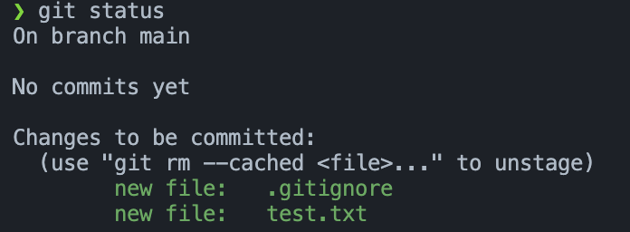
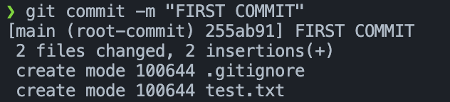
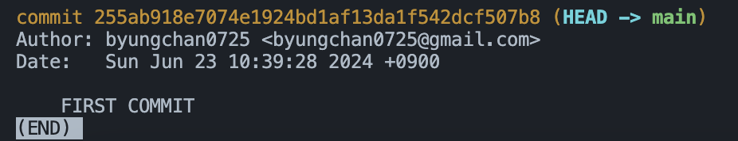

### Commit 생성하기 
#### 현재 관리 되고 있는 파일 확인하기 
```
git status 
```
  
- .gitignore 사용법에서 내용이 이어진다. 

<br> 

#### 관리 대상 추가하기 
```
git add <파일 명>
```  
위처럼 입력하여 관리할 파일을 추가해준다.  
- 나는 test.txt 파일을 관리 대상으로 지정하였다.   


<br>

#### 관리 대상 확인 

   
이제 test.txt 파일이 관리가 되고 있다.  

<br>

#### 모든 파일 추가 
```
git add .
```



#### Commit 하기 

```
git commit -m "커밋 메시지"
```

커밋 메시지를 **FIRST COMMIT**로 지정하였다.   
    


그 다음 status를 확인해보면 변경 사항이 없기 때문에 관리할 파일이 없다고 뜬다.   


<br>

#### commit 로그 확인하기 
```
git log
```
내가 commit 했던 로그를 확인할 수 있다. 
