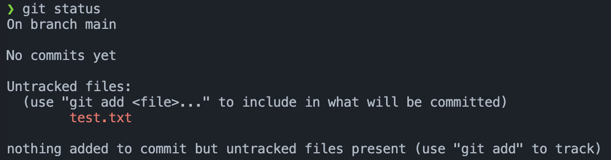

### 프로젝트 관리 방법 

- 프로젝트 파일 관리 방법 

<br>

#### 간단하게 파일 1개 생성 
```
touch test.txt 
```
파일 생성 후 안에 아무렇게나 적어준다.  

<br>

#### 저장을 한다고 해서 관리가 되는것이 아니다 
```
git status
```
- 위 명령어를 입력하면 현재 관리가 안된 파일이 뜬다. 

