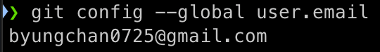

### 깃 초기 설정 

- Git 전역으로 사용자 이름과 이메일 설정 방법 

<br>

#### 터미널에 아래 명령어를 입력 
```
git config --global user.name <내 이름>

git config --global user.emgial <내 이메일>
```

<br>

#### 아래 명령어로 name과 email 확인 
```
git config --global user.name 

git config --global user.email 
```

#### 확인 

