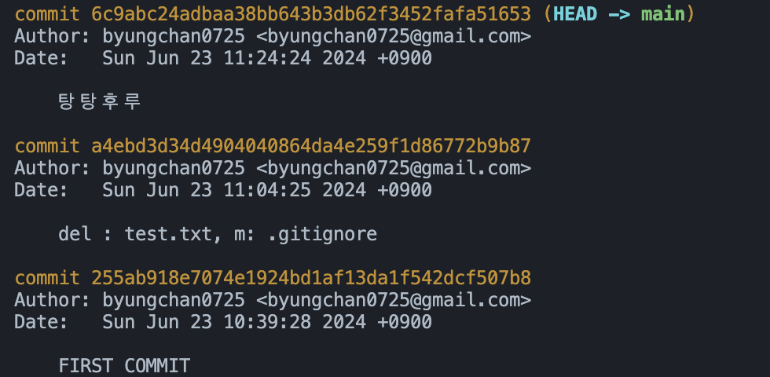
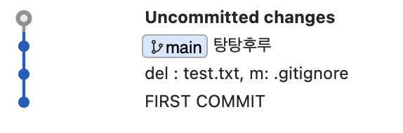

### Reset 방법 

Reset을 하기 전 Sourcetree 모습 


- .git 파일 백업필요.

<br>

#### 돌아가기 위해 log 출력 


두 번째 커밋으로 돌아가기 위해 **a4ebd3d... 복사**

<br>

```
git reset --hard a4ebd3d34d4904040864da4e
```

<br> 

#### Reset으로 돌아간 결과 확인 
  

앞에서 추가햇던 **tangtang.txt**의 커밋 내역 **탕탕후루**가 사라진 모습을 확인할 수 있다.

<br>

#### 다시 되돌리기 
- 백업했던 .git 파일을 다시 넣어주고 다시 git source를 확인한다.  



#### 최신 커밋으로 이동하기 
```
git reset --hard
```

#### 다시 처음으로 돌아온 모습 
