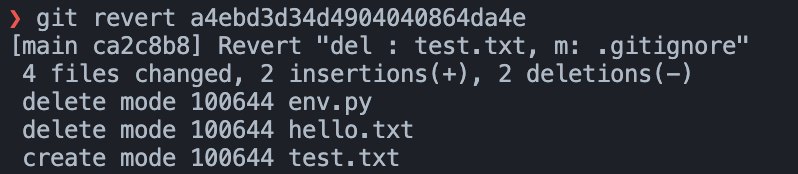
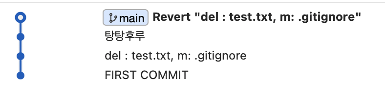

### Revert 방법 

Reset을 하기 전 Sourcetree 모습 


- .git 파일 백업필요.

<br>

#### 돌아가기 위해 log 출력 


두 번째 커밋으로 돌아가기 위해 **a4ebd3d... 복사**

<br>

```
git revert a4ebd3d34d4904040864da4e
```

```
  1 Revert "del : test.txt, m: .gitignore"
  2 
  3 This reverts commit a4ebd3d34d4904040864da4e259f1d86772b9b87.
  4 
  5 # Please enter the commit message for your changes. Lines starting
  6 # with '#' will be ignored, and an empty message aborts the commit.
  7 #
  8 # On branch main
  9 # Changes to be committed:
 10 #   modified:   .gitignore
 11 #   deleted:    env.py
 12 #   deleted:    hello.txt
 13 #   new file:   test.txt
 14 #
```
이렇게 뭐라고 뜨지만 **esc -> :wq**

#### Revert로 돌아간 결과 확인



<br>

#### Sourcetree 확인 
  

Revert의 특징은 돌아가기전에 해당 커밋 내역을 맨 위에 생성하고 돌아가는 것 이였다.  
그래서 맨 위에 커밋 내역이 생성 된 모습을 확인할 수 있다.   

