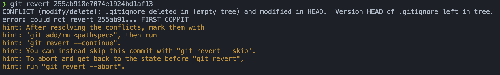
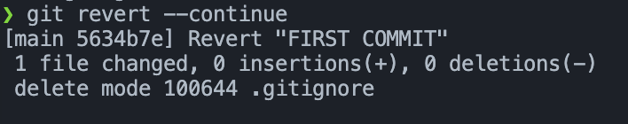

### Revert 에러 해결 방법 

#### 일단 에러 상황을 만들어보자 


에러 상황을 만들기 위해서 FIRST COMMIT으로 이동하겠다. 

FIRST COMMIT 히스토리는
- +.gitignore  
- +test.txt

<br>

gitignore, test.txt가 생성되었으며, 돌아가면 반대로 되기 때문에 gitignore, test.txt가 없는 상황이 되는 것이다.

**FIRST COMMIT: 255ab918e7074e1924bd1af13**

<br>

#### FIRST COMMIT으로 돌아가기 
```
git revert 255ab918e7074e1924bd1af13
```

<br>

#### 에러 발생 
현재 **탕탕후루** 라는 커밋 내역에서는 .gitignore가 있기 때문에 에러가 발생하게 된다. 


- 최신 내역에는 .gitignore가 수정되어 있는데 전으로 돌아가려니 파일이 삭제되어있다.  
- 그러니 너가 삭제를 하던 뭘 하든 해서 해결하고 revert를 하라고 에러가 뜬다.  

이럴 때는 아래와 같은 명령어를 입력해줘서 게속 revert를 진행한다.

```
git rm .gitignore

git revert --continue
```



<br>

#### 만약 다시 Revert 전으로 돌아가고 싶다면
```
git reset --hard 6c9abc24adbaa38bb
``` 
해당 commit의 해시를 reset --hard로 돌려주면 된다.

<br>

#### 추가 팁 
```
git revert --no-commit "커밋 해시"
```
위 처럼 하게 되면 Revert를 하더라도 commit이 되지않는다. 
- 내가 따로 커밋을 해주어야함 