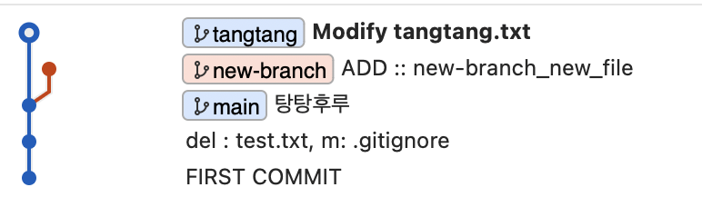

### Branch란

#### Branch를 사용하는 이유   
- 프로젝트를 하나 이상의 모습으로 관리해야할 때  
- 여러 작업들이 각각 독립되어 실행될 때   
    - 예) 신기능1, 신기능2, ...   
  
<br>

  

<br>

#### Branch 생성하기
```
git branch new_branch

git branch
```

출력: 
```
* main
  new-branch
(END)
```
- 현재 main branch에 있다는 것을 보여준다.  

<br>

#### Branch 이동하기 
```
git switch new-branch 

git branch 
```


출력: 
```
  main
* new-branch
(END)
```  
- new_branch로 전환되어있는 모습을 확인할 수 있다.


<br>

#### Branch 만들고 이동하기 
```
git switch -c new_branch_2

git branch
```  
- 아마도 -c가 create인 것 같다.


출력: 
```
  main
  new-branch
* new_branch_2
(END)
```  

<br>

#### Branch 이름 수정 방법
```
git branch -m new-branch new_branch

git branch
```

출력: 
```
  main
  new_branch
* new_branch_2
(END)
```  

<br>

#### Branch 삭제 방법 
```
git branch -d new_branch_2

git branch
```
출력: 
```
* main
new-branch
```
삭제된 모습이다.

<br>

#### Branch 생성 후 Commit   
- 1. 새로운 파일 생성 
```
git switch new-branch 

touch new-branch_new_file 

git add new-branch_new_file 

git commit -m "ADD :: new_file"  
```  
  
<br>

- 2. 파일 수정 

```
git switch -c tangtang 

> tangtang.txt 파일 아무렇게나 수정 

git add tangtang.txt 

git commit -m "Modifty tangtang.txt"
```  

<br>

