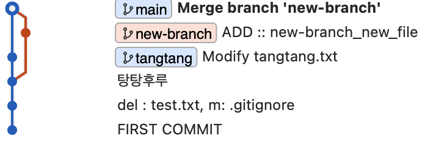

### Merge 

#### 사용 방법 

```
git switch main

git merge <합칠 branch name>
```



merge가 된 모습을 확인할 수 있으며 reset으로 되돌릴 수 있다.  


<br>

#### branch 삭제  

병합이 다 끝난 branch new_branch는 삭제하거나 삭제하지 않아도 된다.  
여기에서는 삭제를 하도록 하겠다.  

```
git branch -d new_branch
```

