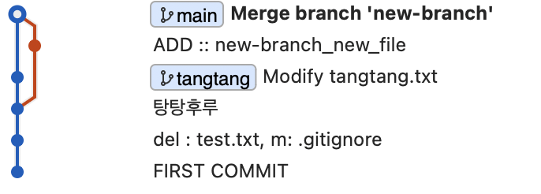

### Rebase 

#### 사용 방법 

rebase는 merge와 사용 방법이 다르다.  
작업중인 branch로 이동하여 합친다.

```
git switch <작업 중인 branch name> 

git rebase main
```

<br>

#### rebase 전 

 

#### rebase 후 

 
tangtang이라는 branch가 main과 같이 있는 모습을 확인할 수 있다.  
- 수정 사항이 같아서 위로 올라가지 않았음.  

만약 rebase한 branch가 main과 위치가 같지 않다면 main으로 이동 후 merge를 진행하면 된다.  
효율은 별로 안좋은듯?  

<br>

```
git branch -d tangtang 
```

 