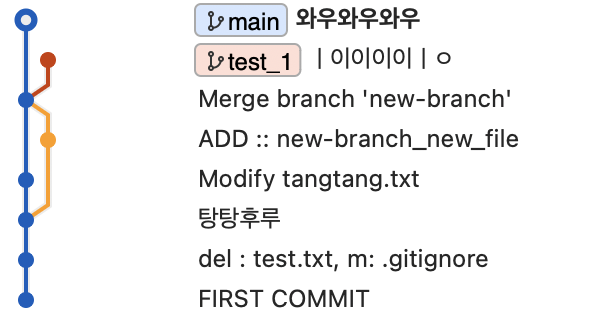

### branch merge 에러  

#### 먼저 에러가 나도록 해보자  

```
git branch test_1 

> 아무런 파일 수정 (main)

git switch test_1 

> main에서 수정한 파일과 똑같은 파일 아무렇게 수정 

> 모든 파일 commit 필요 
```

<br>

#### merge 전 

  


```
git switch main 

git merge test_1 
```

<br>

#### 에러가 잘 나는 모습 

   

여기에서 나는 위 **현재 변경 사항 수락**을 누르도록 하겠다.  


<br>

#### 변경 사항 수락 확인 

  


<br>


#### 만약 변경 사항이 너무 많다면?

```
git merge --abort
```   
를 입력해 merge를 취소하고 main으로 돌아간다.  

그리고 다시 merge를 하면 된다.  


<br>

#### 만약 rebase를 사용한다면? 

```
git rebase --abort 

git rebase --continue
```