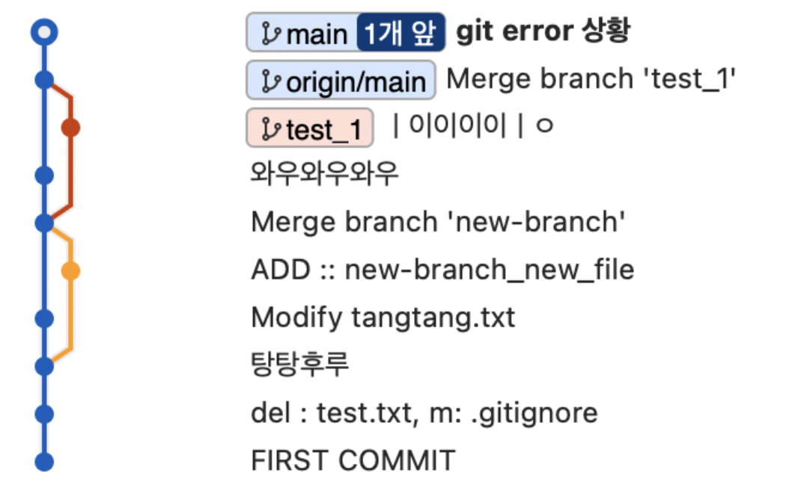
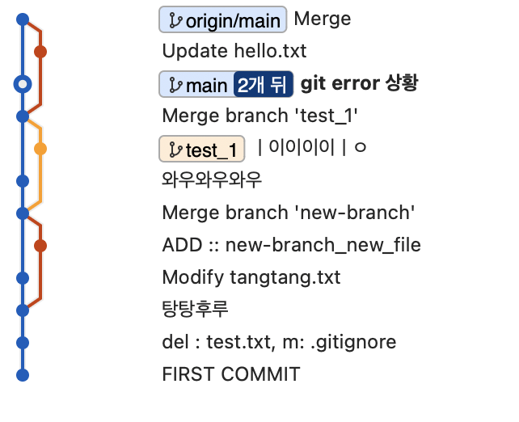

### push 에러 

#### push 에러 상황 만들어보기  

- 작업중인 파일을 깃허브에 들어가서 수정하고 Commit한 다음 작업 중인 파일을 push해보겠다.  


<br>


#### 에러가 나는 이유  
- 현재 branch가 최신 branch보다 뒤에 있기 때문  

  

<br>


#### 해결 방법 1. (Merge 방식)
```
git pull --no-rebase 
```

  

branch가 나눠지고 merge된 모습을 확인할 수 있다.  


<br>

#### 해결 방법 2. (Rebase 방식)

일단 뒤로 되돌리자
```
git reset --hard <돌아갈 커밋 로그의 번호>
```



```
git pull --rebase 
```

<br>

#### 잘 합쳐진 모습  


<br>

#### 강제 push 하는 법 

```
git push --force 
```