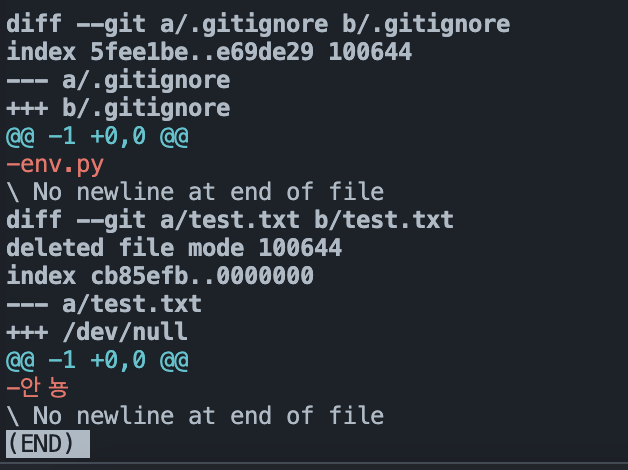
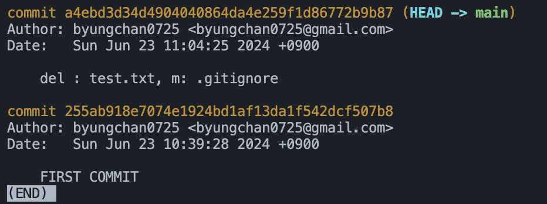

### 파일 수정 후 Status, Commit 하기 
#### 파일 수정하기 

- **test.txt** 파일을 삭제한다.
- **hello.txt** 파일을 생성한다.   
- **.gitignore** 파일안의 내용을 다 지운다.  

<br>

#### git status로 현재 변경사항 확인하기 


- **modified: .gitignore**: gitignore 파일이 수정되었다.  
- **deleted: test.txt**: test.txt 파일이 삭제 되었다.  
- untracked: 
    - 새로운 파일이 생김 

<br>

#### 변경사항 자세하게 확인하기
```
git dff
```


<br>

#### 파일 커밋 준비 후 status 확인 
```
git add .
```
  

- .gitignore가 수정되었다.
- 새로운 파일 env.py, hello.txt 가 생성되었다.  
- test.txt가 삭제되었다.  

#### git log 확인 
  


<br>

#### 명령어 두 번 쓰는게 불편하다면 
```
git -am "커밋 메시지"
```
모든 파일을 스테이지에 올리고 커밋을 한다.

