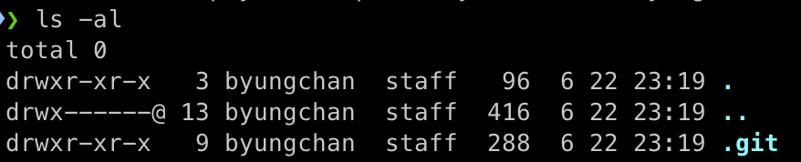

### 프로젝트 초기 설정 

- 프로젝트 폴더 생성하는 방법 

<br>

#### 터미널에서 프로젝트 폴더 생성 
```
mkdir test_folder && cd test_folder
```
- test_folder 라는 폴더를 생성한 후 폴더로 이동 

<br>

#### 터미널에 아래 명령어 입력 
```
> git init
Initialized empty Git repository in /Users/byungchan/Desktop/test_folder/.git/
```
초기화 되었다고 뜬다.

<br>

#### 잘 생성되었는지 확인하기 위해 아래 명령어 입력 
```
ls -al 
```


**.git** 이 잘 생성된 모습이다.

<br>

> 만약 **.git** 폴더를 지운다면 모든 관리 내역이 사라지니 조심하자.