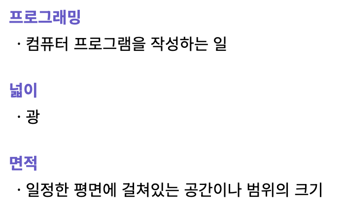

### 나열의 요소들  

#### ul (순서가 상관없는 리스트)

```
<ul>
    <li>사과</li>
    <li>바나나</li>
</ul>
```

<br>

#### ol (순서가 상관있는 리스트)

```
<ol>
    <li>1</li>
    <li>2</li>
</ol>
```

#### 순서 변경하는 방법
```<ol type="A" start="3"> ``` 으로 하면 순서는 A,B,C, ...로 정렬된다.  
또한 순서는 3부터 시작하기 때문에 C부터 시작된다.  

<br>


### 용어와 정의 나열하기  

`<dl>, <dt>, <dd>`: 용어, 정의 

  

css로 style을 조금 설정해주었다.  
